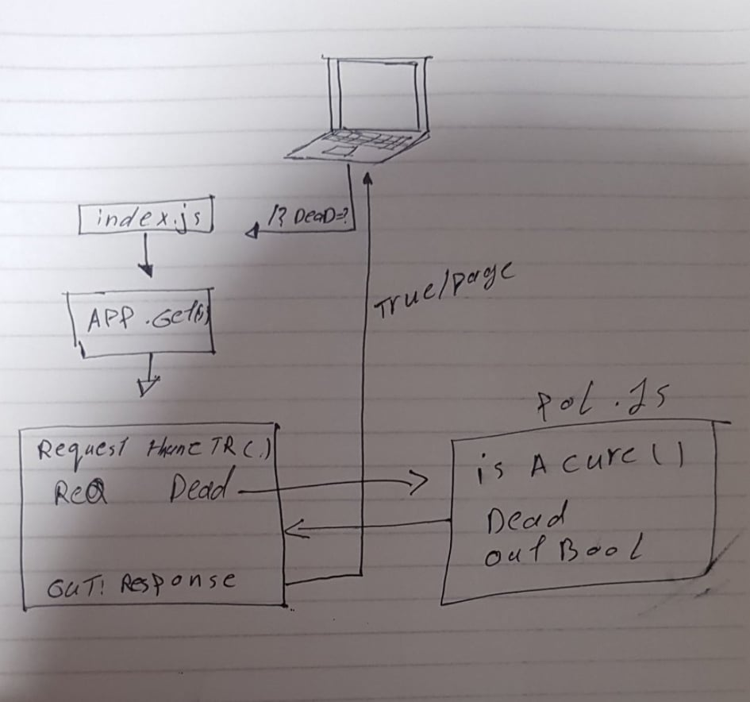

# LAB - 00

## Project: Proof of live severs

### Author: Ahmad Kmal

### Links and Resources

- [submission PR](https://github.com/401-advanced-javascript-ahmadkmal/lab-00/pull/1)
- [triva s](https://travis-ci.org/github/401-advanced-javascript-ahmadkmal/lab-00/builds/691828293)
- [ci/cd](https://github.com/401-advanced-javascript-ahmadkmal/lab-00/actions/runs/117071089)
- [front-end application](https://prelab.herokuapp.com/)

### decumantaion

- [jsdoc](https://prelab.herokuapp.com/docs/)

### Setup

#### `.env` requirements (where applicable)

i.e.

- `PORT` - 3000

#### How to initialize/run your application (where applicable)

- e.g. `npm start`

#### How to use your library (where applicable)

#### Tests

- How do you run tests? unit test : npm test / lint test :npm run lint
- Any tests of note? jsdoc
- Describe any tests that you did not complete, skipped, etc: non

#### UML

